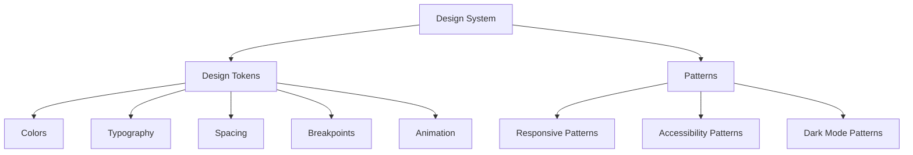
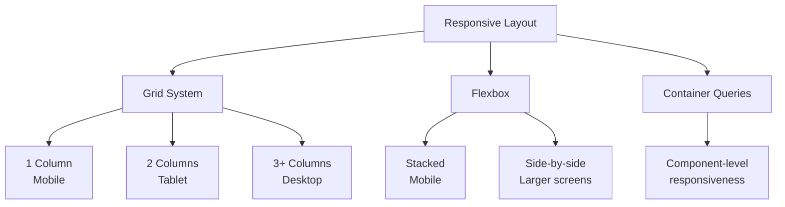

# X-Echo Design System

## Overview

This document outlines the design system for X-Echo's frontend development, focusing on mobile-first approach, dark mode support, and web accessibility compliance. The design system provides a foundation for consistent user experience and efficient development.

## Current Frontend Environment

- Next.js 15.2.3
- Tailwind CSS 4
- React 19.0.0
- Basic dark mode support in `globals.css`
- Geist font configured

## Design System Structure



## 1. Design Tokens

### Color System

Semantic naming with dark mode considerations:

```typescript
// Design Tokens: Colors
const colors = {
  // Brand colors
  primary: {
    50: '#e6f1ff',
    100: '#cce3ff',
    200: '#99c7ff',
    300: '#66abff',
    400: '#338fff',
    500: '#0073ff', // Main color
    600: '#005cd9',
    700: '#0044b3',
    800: '#002d8c',
    900: '#001766',
  },
  // Grayscale
  neutral: {
    50: '#f9fafb',
    100: '#f3f4f6',
    200: '#e5e7eb',
    300: '#d1d5db',
    400: '#9ca3af',
    500: '#6b7280',
    600: '#4b5563',
    700: '#374151',
    800: '#1f2937',
    900: '#111827',
  },
  // Functional colors
  success: {
    light: '#d1fae5',
    DEFAULT: '#10b981',
    dark: '#065f46',
  },
  warning: {
    light: '#fef3c7',
    DEFAULT: '#f59e0b',
    dark: '#92400e',
  },
  error: {
    light: '#fee2e2',
    DEFAULT: '#ef4444',
    dark: '#b91c1c',
  },
  info: {
    light: '#dbeafe',
    DEFAULT: '#3b82f6',
    dark: '#1e40af',
  },
}
```

### Typography System

Accessible font sizes and line heights:

```typescript
// Design Tokens: Typography
const typography = {
  fontFamily: {
    sans: 'var(--font-geist-sans)',
    mono: 'var(--font-geist-mono)',
  },
  fontSize: {
    xs: '0.75rem',     // 12px
    sm: '0.875rem',    // 14px
    base: '1rem',      // 16px
    lg: '1.125rem',    // 18px
    xl: '1.25rem',     // 20px
    '2xl': '1.5rem',   // 24px
    '3xl': '1.875rem', // 30px
    '4xl': '2.25rem',  // 36px
    '5xl': '3rem',     // 48px
  },
  lineHeight: {
    none: '1',
    tight: '1.25',
    snug: '1.375',
    normal: '1.5',
    relaxed: '1.625',
    loose: '2',
  },
  fontWeight: {
    light: '300',
    normal: '400',
    medium: '500',
    semibold: '600',
    bold: '700',
  },
  letterSpacing: {
    tighter: '-0.05em',
    tight: '-0.025em',
    normal: '0',
    wide: '0.025em',
    wider: '0.05em',
    widest: '0.1em',
  },
}
```

### Spacing System

Consistent spacing for UI coherence:

```typescript
// Design Tokens: Spacing
const spacing = {
  px: '1px',
  0: '0',
  0.5: '0.125rem', // 2px
  1: '0.25rem',    // 4px
  1.5: '0.375rem', // 6px
  2: '0.5rem',     // 8px
  2.5: '0.625rem', // 10px
  3: '0.75rem',    // 12px
  3.5: '0.875rem', // 14px
  4: '1rem',       // 16px
  5: '1.25rem',    // 20px
  6: '1.5rem',     // 24px
  8: '2rem',       // 32px
  10: '2.5rem',    // 40px
  12: '3rem',      // 48px
  16: '4rem',      // 64px
  20: '5rem',      // 80px
  24: '6rem',      // 96px
  32: '8rem',      // 128px
}
```

### Breakpoints

Mobile-first approach breakpoints:

```typescript
// Design Tokens: Breakpoints
const breakpoints = {
  sm: '40rem',  // 640px
  md: '48rem',  // 768px
  lg: '64rem',  // 1024px
  xl: '80rem',  // 1280px
  '2xl': '96rem', // 1536px
}
```

### Animation

Consistent animation system:

```typescript
// Design Tokens: Animation
const animation = {
  duration: {
    fast: '150ms',
    normal: '300ms',
    slow: '500ms',
  },
  timing: {
    ease: 'cubic-bezier(0.25, 0.1, 0.25, 1)',
    easeIn: 'cubic-bezier(0.42, 0, 1, 1)',
    easeOut: 'cubic-bezier(0, 0, 0.58, 1)',
    easeInOut: 'cubic-bezier(0.42, 0, 0.58, 1)',
  },
}
```

## 2. Responsive Design Strategy

### Mobile-First Approach

Leveraging Tailwind CSS's mobile-first approach with the following principles:

1. Base styles designed for mobile
2. Breakpoint prefixes used for larger screen sizes
3. Container queries utilized for styling based on parent element size

```html
<!-- Mobile-first example -->
<div class="flex flex-col md:flex-row">
  <!-- Stacked on mobile, side-by-side on tablet and above -->
</div>

<!-- Container query example -->
<div class="@container">
  <div class="flex flex-col @md:flex-row">
    <!-- Changes based on container size -->
  </div>
</div>
```

### Responsive Layout Patterns



### Responsive Design Best Practices

1. **Mobile-First Thinking**
   - Start design from smallest screen size
   - Expand to larger screen sizes as needed

2. **Flexible Layouts**
   - Use relative units (rem, %) instead of fixed widths
   - Leverage grid and flexbox

3. **Container Queries**
   - Style based on parent element size
   - Improve adaptability of reusable components

4. **Minimize Breakpoints**
   - Use only necessary breakpoints
   - Choose breakpoints based on content

5. **Touch Target Optimization**
   - Minimum touch target size of 44px × 44px on mobile
   - Ensure adequate spacing

## 3. Dark Mode Support

Utilizing Tailwind CSS's dark mode functionality with semantic color tokens:

```css
/* globals.css */
:root {
  /* Light mode defaults */
  --color-background: #ffffff;
  --color-foreground: #171717;
  --color-primary: #0073ff;
  --color-primary-foreground: #ffffff;
  --color-secondary: #f3f4f6;
  --color-secondary-foreground: #1f2937;
  --color-muted: #9ca3af;
  --color-muted-foreground: #4b5563;
  --color-accent: #f59e0b;
  --color-accent-foreground: #ffffff;
  --color-destructive: #ef4444;
  --color-destructive-foreground: #ffffff;
  --color-border: #e5e7eb;
  --color-input: #ffffff;
  --color-ring: rgba(0, 115, 255, 0.3);
}

@media (prefers-color-scheme: dark) {
  :root {
    /* Dark mode values */
    --color-background: #0a0a0a;
    --color-foreground: #ededed;
    --color-primary: #338fff;
    --color-primary-foreground: #ffffff;
    --color-secondary: #1f2937;
    --color-secondary-foreground: #f3f4f6;
    --color-muted: #4b5563;
    --color-muted-foreground: #9ca3af;
    --color-accent: #f59e0b;
    --color-accent-foreground: #ffffff;
    --color-destructive: #ef4444;
    --color-destructive-foreground: #ffffff;
    --color-border: #374151;
    --color-input: #1f2937;
    --color-ring: rgba(51, 143, 255, 0.3);
  }
}
```

### Theme Switching Functionality

Allow users to toggle dark mode independently of system settings:

```typescript
// Theme switching custom hook
'use client'

import { useEffect, useState } from 'react'

type Theme = 'light' | 'dark' | 'system'

export function useTheme() {
  const [theme, setTheme] = useState<Theme>('system')

  useEffect(() => {
    const savedTheme = localStorage.getItem('theme') as Theme | null
    if (savedTheme) {
      setTheme(savedTheme)
      applyTheme(savedTheme)
    }
  }, [])

  const applyTheme = (newTheme: Theme) => {
    const root = document.documentElement
    root.classList.remove('light', 'dark')

    if (newTheme === 'system') {
      const systemTheme = window.matchMedia('(prefers-color-scheme: dark)').matches ? 'dark' : 'light'
      root.classList.add(systemTheme)
    } else {
      root.classList.add(newTheme)
    }
  }

  const setThemeAndSave = (newTheme: Theme) => {
    setTheme(newTheme)
    localStorage.setItem('theme', newTheme)
    applyTheme(newTheme)
  }

  return { theme, setTheme: setThemeAndSave }
}
```

### Dark Mode Best Practices

1. **Semantic Color Tokens**
   - Use meaning-based variables instead of direct color references
   - Example: Use `bg-background` and `text-foreground`

2. **Contrast Ratio**
   - Maintain WCAG AA level (4.5:1) contrast ratio in dark mode
   - Verify contrast between text and background

3. **Saturation and Brightness Adjustments**
   - Lower saturation and increase brightness in dark mode
   - Consider eye strain reduction

4. **Shadow Adjustments**
   - Light mode: Dark shadows with low opacity
   - Dark mode: Light shadows with higher opacity

5. **Testing**
   - Test regularly in both modes
   - Verify appearance on actual devices

## 4. Accessibility Support

Design following WAI-ARIA compliance principles:

1. Semantic HTML elements
2. Appropriate ARIA roles and attributes
3. Keyboard navigation support
4. Sufficient contrast ratios
5. Visual focus indicators
6. Screen reader support

### Accessibility Best Practices

1. **Semantic HTML**
   - Use appropriate HTML elements (`button`, `nav`, `header`, etc.)
   - Consider meaning, not just appearance

2. **Keyboard Accessibility**
   - Make all functionality operable via keyboard
   - Ensure logical focus order
   - Provide visual focus indicators

3. **Screen Reader Support**
   - Provide appropriate alt text
   - Use ARIA landmarks
   - Announce dynamic content changes

4. **Color and Contrast**
   - Don't rely solely on color to convey information
   - Maintain WCAG AA level (4.5:1) contrast ratio
   - Verify text size and background color combinations

5. **Form Accessibility**
   - Associate labels with form elements
   - Clearly display error messages
   - Provide input assistance and validation

### Accessibility Checklist

- [ ] Use semantic HTML elements
- [ ] Use appropriate ARIA roles and attributes
- [ ] Support keyboard navigation
- [ ] Ensure WCAG AA level contrast ratios
- [ ] Provide visual focus indicators
- [ ] Test with screen readers
- [ ] Support zoom/magnification
- [ ] Properly announce dynamic content changes

## 5. CSS Design Approach

### Leveraging Tailwind CSS

1. **Utility-First**
   - Combine small, single-purpose classes
   - Minimize custom CSS

2. **Extensibility**
   - Customize theme
   - Utilize plugins
   - Extend utilities as needed

3. **Consistency**
   - Use design token-based values
   - Maintain naming conventions

### CSS Modules Integration

1. **Component-Specific Styles**
   - Use CSS Modules for complex styles
   - Avoid name collisions

2. **Global Styles**
   - Reset and base styles
   - Variable definitions

3. **Optimization**
   - Remove unused CSS
   - Compress CSS

## 6. Implementation Plan

### Phase 1: Design Tokens and Base Styles

1. Define design tokens
   - Color system
   - Typography system
   - Spacing system
   - Breakpoints
   - Animation

2. Implement base styles
   - Reset CSS
   - Global styles
   - Utility classes

### Phase 2: Responsive Layout and Dark Mode

1. Design responsive layout
   - Grid system
   - Flexbox patterns
   - Container query usage

2. Implement dark mode
   - Theme switching functionality
   - Color token application

### Phase 3: Accessibility Implementation

1. Accessibility implementation
   - Focus management
   - Keyboard navigation
   - Screen reader testing
   - Contrast ratio verification

## 7. Documentation Plan

1. Design system documentation
   - Design token explanation
   - Responsive design patterns
   - Accessibility guidelines
   - CSS usage methodology

## Conclusion

This design system for X-Echo's frontend development is built on the principles of mobile-first approach, dark mode support, and web accessibility compliance. It leverages Tailwind CSS 4's features and considers Next.js's Server and Client Component characteristics.

The design system provides consistent user experience, improves development efficiency, and ensures future extensibility. By considering accessibility from the beginning, we create an application that is usable for all users.

Specific component implementation will be developed incrementally after design tokens and patterns are established, based on project requirements.
