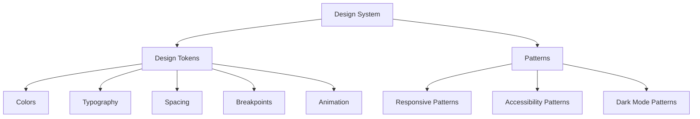

# Frontend Development Patterns

## Design System

The X-Echo design system provides a foundation for consistent user experience and efficient development, focusing on mobile-first design, dark mode support, and web accessibility compliance.

### Design System Structure



### Design Tokens

Design tokens are the atomic values that form the foundation of the design system. They are implemented as TypeScript constants with strict type definitions using the `as const satisfies` pattern for type safety.

#### Color System

The color system includes brand colors, grayscale, and functional colors:

```typescript
// Example of color tokens implementation
export const colors = {
  // Brand colors
  primary: {
    50: '#e6f1ff',
    100: '#cce3ff',
    200: '#99c7ff',
    300: '#66abff',
    400: '#338fff',
    500: '#0073ff', // Main color
    600: '#005cd9',
    700: '#0044b3',
    800: '#002d8c',
    900: '#001766',
  },
  // Grayscale
  neutral: {
    50: '#f9fafb',
    100: '#f3f4f6',
    200: '#e5e7eb',
    300: '#d1d5db',
    400: '#9ca3af',
    500: '#6b7280',
    600: '#4b5563',
    700: '#374151',
    800: '#1f2937',
    900: '#111827',
  },
  // Functional colors
  success: {
    light: '#d1fae5',
    DEFAULT: '#10b981',
    dark: '#065f46',
  },
  warning: {
    light: '#fef3c7',
    DEFAULT: '#f59e0b',
    dark: '#92400e',
  },
  error: {
    light: '#fee2e2',
    DEFAULT: '#ef4444',
    dark: '#b91c1c',
  },
  info: {
    light: '#dbeafe',
    DEFAULT: '#3b82f6',
    dark: '#1e40af',
  },
} as const satisfies ColorPalette;
```

#### Typography System

The typography system defines font families, sizes, weights, line heights, and letter spacing:

```typescript
// Example of typography tokens implementation
export const typography = {
  fontFamily: {
    sans: 'var(--font-geist-sans)',
    mono: 'var(--font-geist-mono)',
  },
  fontSize: {
    xs: '0.75rem',     // 12px
    sm: '0.875rem',    // 14px
    base: '1rem',      // 16px
    lg: '1.125rem',    // 18px
    xl: '1.25rem',     // 20px
    '2xl': '1.5rem',   // 24px
    '3xl': '1.875rem', // 30px
    '4xl': '2.25rem',  // 36px
    '5xl': '3rem',     // 48px
  },
  lineHeight: {
    none: '1',
    tight: '1.25',
    snug: '1.375',
    normal: '1.5',
    relaxed: '1.625',
    loose: '2',
  },
  fontWeight: {
    light: '300',
    normal: '400',
    medium: '500',
    semibold: '600',
    bold: '700',
  },
  letterSpacing: {
    tighter: '-0.05em',
    tight: '-0.025em',
    normal: '0',
    wide: '0.025em',
    wider: '0.05em',
    widest: '0.1em',
  },
} as const satisfies Typography;
```

#### Spacing System

The spacing system provides consistent spacing values:

```typescript
// Example of spacing tokens implementation
export const spacing = {
  px: '1px',
  0: '0',
  0.5: '0.125rem', // 2px
  1: '0.25rem',    // 4px
  1.5: '0.375rem', // 6px
  2: '0.5rem',     // 8px
  2.5: '0.625rem', // 10px
  3: '0.75rem',    // 12px
  3.5: '0.875rem', // 14px
  4: '1rem',       // 16px
  5: '1.25rem',    // 20px
  6: '1.5rem',     // 24px
  8: '2rem',       // 32px
  10: '2.5rem',    // 40px
  12: '3rem',      // 48px
  16: '4rem',      // 64px
  20: '5rem',      // 80px
  24: '6rem',      // 96px
  32: '8rem',      // 128px
} as const satisfies Spacing;
```

#### Breakpoints

The breakpoints system defines screen size breakpoints for responsive design:

```typescript
// Example of breakpoints tokens implementation
export const breakpoints = {
  sm: '40rem',  // 640px
  md: '48rem',  // 768px
  lg: '64rem',  // 1024px
  xl: '80rem',  // 1280px
  '2xl': '96rem', // 1536px
} as const satisfies Breakpoints;
```

#### Animation

The animation system defines duration and timing functions:

```typescript
// Example of animation tokens implementation
export const animation = {
  duration: {
    fast: '150ms',
    normal: '300ms',
    slow: '500ms',
  },
  timing: {
    ease: 'cubic-bezier(0.25, 0.1, 0.25, 1)',
    easeIn: 'cubic-bezier(0.42, 0, 1, 1)',
    easeOut: 'cubic-bezier(0, 0, 0.58, 1)',
    easeInOut: 'cubic-bezier(0.42, 0, 0.58, 1)',
  },
} as const satisfies Animation;
```

### Dark Mode Support

The design system includes dark mode support with semantic color tokens:

```css
/* Example of dark mode implementation in globals.css */
:root {
  /* Light mode defaults */
  --color-background: #ffffff;
  --color-foreground: #171717;
  --color-primary: #0073ff;
  --color-primary-foreground: #ffffff;
  /* ... other color tokens */
}

@media (prefers-color-scheme: dark) {
  :root {
    /* Dark mode values */
    --color-background: #0a0a0a;
    --color-foreground: #ededed;
    --color-primary: #338fff;
    --color-primary-foreground: #ffffff;
    /* ... other color tokens */
  }
}
```

### Theme Switching

The design system includes a theme switching mechanism using React context:

```typescript
// Example of theme switching implementation
'use client'

import { useEffect, useState } from 'react'
import { Theme } from '@/types/theme'

export function useTheme() {
  const [theme, setTheme] = useState<Theme>('system')

  useEffect(() => {
    // Load theme from localStorage
    const savedTheme = localStorage.getItem('theme') as Theme | null
    if (savedTheme) {
      setTheme(savedTheme)
      applyTheme(savedTheme)
    }
  }, [])

  const applyTheme = (newTheme: Theme) => {
    const root = document.documentElement
    root.classList.remove('light', 'dark')

    if (newTheme === 'system') {
      const systemTheme = window.matchMedia('(prefers-color-scheme: dark)').matches ? 'dark' : 'light'
      root.classList.add(systemTheme)
    } else {
      root.classList.add(newTheme)
    }
  }

  const setThemeAndSave = (newTheme: Theme) => {
    setTheme(newTheme)
    localStorage.setItem('theme', newTheme)
    applyTheme(newTheme)
  }

  return { theme, setTheme: setThemeAndSave }
}
```

### Accessibility Support

The design system includes accessibility features:

```css
/* Example of accessibility styles in globals.css */
/* Focus styles for accessibility */
*:focus-visible {
  outline: 2px solid var(--color-primary);
  outline-offset: 2px;
  border-radius: 0.25rem;
}

/* Skip to content link */
.skip-to-content {
  position: absolute;
  left: -9999px;
  top: auto;
  width: 1px;
  height: 1px;
  overflow: hidden;
}

.skip-to-content:focus {
  position: fixed;
  top: 0;
  left: 0;
  width: auto;
  height: auto;
  padding: 0.5rem 1rem;
  background-color: var(--color-background);
  color: var(--color-foreground);
  z-index: 9999;
  border: 2px solid var(--color-primary);
}

/* Ensure touch targets are large enough */
.touch-target {
  min-height: 44px;
  min-width: 44px;
}
```

## Next.js Component Model

Next.js App Router supports both React Server Components and Client Components. Combining these appropriately optimizes both performance and interactivity.

### Server Components vs Client Components

| What do you need to do? | Server Component | Client Component |
|-------------------------|-----------------|------------------|
| Fetch data | ✅ | ❌ |
| Access backend resources (directly) | ✅ | ❌ |
| Keep sensitive information on the server | ✅ | ❌ |
| Reduce client-side JavaScript | ✅ | ❌ |
| Add interactivity and event listeners | ❌ | ✅ |
| Use State and Lifecycle Effects | ❌ | ✅ |
| Use browser-only APIs | ❌ | ✅ |
| Use custom hooks that depend on state/effects | ❌ | ✅ |
| Use React Class components | ❌ | ✅ |

## Recommended Implementation Patterns

### 1. Moving Client Components Down the Tree

To optimize performance, place Client Components as low as possible in the component tree.

```tsx
// Good example: Only making interactive parts Client Components
// page.tsx (Server Component)
import SearchBar from './search-bar' // Client Component
import Results from './results'      // Server Component

export default function Page() {
  return (
    <div>
      <h1>Product Search</h1>
      <SearchBar /> {/* Only interactive part is Client Component */}
      <Results />  {/* Static display part is Server Component */}
    </div>
  )
}
```

### 2. Passing Server Components as Children to Client Components

```tsx
// client-component.tsx
'use client'
export default function ClientComponent({ children }) {
  const [count, setCount] = useState(0)
  return (
    <div>
      <button onClick={() => setCount(count + 1)}>{count}</button>
      {children} {/* Server Component renders here */}
    </div>
  )
}

// page.tsx (Server Component)
import ClientComponent from './client-component'
import ServerComponent from './server-component'

export default function Page() {
  return (
    <ClientComponent>
      <ServerComponent />
    </ClientComponent>
  )
}
```

### 3. Proper Use of Third-Party Libraries

Many third-party components need to be used as Client Components. Wrap them appropriately:

```tsx
// ui/carousel.tsx
'use client'
import { Carousel } from 'third-party-carousel'
export default Carousel
```

### 4. Proper Context Provider Placement

```tsx
// providers.tsx
'use client'
import { ThemeProvider } from 'theme-context'

export function Providers({ children }) {
  return <ThemeProvider>{children}</ThemeProvider>
}

// layout.tsx (Server Component)
import { Providers } from './providers'

export default function Layout({ children }) {
  return (
    <html>
      <body>
        <Providers>{children}</Providers>
      </body>
    </html>
  )
}
```

### 5. Client Component Wrapper Pattern

When you need to handle events in a form but want to keep the page as a Server Component, use the Client Component Wrapper pattern:

```tsx
// form-wrapper.tsx (Client Component)
'use client'
import { useState } from 'react'
import { Form } from './form'
import type { FormData } from '@/types'

export function FormWrapper() {
  const [isSubmitting, setIsSubmitting] = useState(false)
  const [error, setError] = useState<string | null>(null)

  const handleSubmit = async (data: FormData) => {
    try {
      setIsSubmitting(true)
      setError(null)

      // Handle form submission
      console.log('Form submitted:', data)

      // API call would go here
      // const response = await fetch('/api/endpoint', {...})

    } catch (err) {
      setError('An error occurred')
    } finally {
      setIsSubmitting(false)
    }
  }

  return (
    <>
      {error && <div className="error">{error}</div>}
      <Form onSubmit={handleSubmit} isSubmitting={isSubmitting} />
    </>
  )
}

// page.tsx (Server Component)
import { FormWrapper } from './form-wrapper'

export default function Page() {
  return (
    <div>
      <h1>Form Page</h1>
      <FormWrapper />
    </div>
  )
}
```

This pattern solves the "Event handlers cannot be passed to Client Component props" error by:
1. Keeping the page as a Server Component
2. Moving event handling logic to a Client Component wrapper
3. Using the wrapper in the Server Component instead of directly using the form

## X-Echo Project Specific Implementation Plan

### Authentication Flow
- Login form: Client Component (for form state management)
- Login form wrapper: Client Component (for handling form submission)
- Authentication state management: Client Component + Context Provider
- User information display: Server Component

### Timeline
- Timeline container: Server Component (for data fetching)
- Tweet list: Server Component
- Interaction features (likes, retweets): Client Components

### Tweet Posting
- Post form: Client Component
- Character counter: Client Component
- Submit button: Client Component

### User Profile
- Profile information display: Server Component
- Follow button: Client Component
- Profile edit form: Client Component

## Data Fetching Patterns

### Server Component Data Fetching

Server Components can fetch data directly:

```tsx
// app/users/[username]/page.tsx
export default async function UserProfile({ params }) {
  // This code runs on the server
  const userData = await fetch(`http://localhost:8080/api/users/${params.username}`)
  const user = await userData.json()

  return (
    <div>
      <h1>{user.displayName}</h1>
      <p>@{user.username}</p>
      <UserStats user={user} />
      <UserTweets username={user.username} />
    </div>
  )
}
```

### Client Component Data Fetching

Client Components should use SWR for data fetching:

```tsx
// components/tweet-actions.tsx
'use client'
import useSWR from 'swr'
import { useState } from 'react'

export default function TweetActions({ tweetId }) {
  const { data, mutate } = useSWR(`/api/tweets/${tweetId}`)
  const [isLiking, setIsLiking] = useState(false)

  async function handleLike() {
    setIsLiking(true)
    await fetch(`/api/tweets/${tweetId}/favorite`, { method: 'POST' })
    await mutate() // Revalidate the data
    setIsLiking(false)
  }

  return (
    <div className="tweet-actions">
      <button
        onClick={handleLike}
        disabled={isLiking}
      >
        {data?.isFavorited ? 'Unlike' : 'Like'} ({data?.favoritesCount})
      </button>
      {/* Other actions */}
    </div>
  )
}
```

## State Management Patterns

### Server-Side State

- Use Server Components for initial data fetching
- Pass data down to Client Components as props
- Use SWR for client-side data fetching and caching

### Client-Side State

- Use Zustand for global client-side state management
- Keep state as close as possible to where it's used
- Prefer local component state when possible

Example Zustand store:

```tsx
// store/auth-store.ts
import { create } from 'zustand'

interface AuthState {
  user: User | null
  isAuthenticated: boolean
  login: (credentials: Credentials) => Promise<void>
  logout: () => Promise<void>
}

export const useAuthStore = create<AuthState>((set) => ({
  user: null,
  isAuthenticated: false,

  login: async (credentials) => {
    const response = await fetch('/api/auth/login', {
      method: 'POST',
      headers: { 'Content-Type': 'application/json' },
      body: JSON.stringify(credentials)
    })

    if (response.ok) {
      const data = await response.json()
      set({ user: data.user, isAuthenticated: true })
    } else {
      throw new Error('Login failed')
    }
  },

  logout: async () => {
    await fetch('/api/auth/logout', { method: 'POST' })
    set({ user: null, isAuthenticated: false })
  }
}))
```

## Component Organization

### Directory Structure

```
app/
├── layout.tsx              # Root layout (Server Component)
├── page.tsx                # Home page (Server Component)
├── auth/
│   ├── login/
│   │   └── page.tsx        # Login page (Server Component)
│   └── register/
│       └── page.tsx        # Registration page (Server Component)
├── users/
│   └── [username]/
│       ├── page.tsx        # User profile page (Server Component)
│       └── tweets/
│           └── page.tsx    # User tweets page (Server Component)
└── tweets/
    └── [id]/
        └── page.tsx        # Single tweet page (Server Component)

components/
├── ui/                     # Reusable UI components
│   ├── button.tsx          # Button component (Client Component)
│   ├── input.tsx           # Input component (Client Component)
│   └── card.tsx            # Card component (Server Component)
├── auth/                   # Authentication components
│   ├── login-form.tsx      # Login form (Client Component)
│   └── register-form.tsx   # Registration form (Client Component)
├── tweets/                 # Tweet-related components
│   ├── tweet-card.tsx      # Tweet display (Server Component)
│   ├── tweet-form.tsx      # Tweet creation form (Client Component)
│   └── tweet-actions.tsx   # Tweet interaction buttons (Client Component)
└── users/                  # User-related components
    ├── profile-header.tsx  # User profile header (Server Component)
    ├── follow-button.tsx   # Follow button (Client Component)
    └── user-stats.tsx      # User statistics (Server Component)
```

### Component Naming Conventions

- Use PascalCase for component names
- Use descriptive names that indicate the component's purpose
- Suffix Client Components with a meaningful descriptor (e.g., Form, Button, Actions)
- Group related components in directories

## Testing Patterns

### Server Component Testing

Test Server Components with Vitest and React Testing Library:

```tsx
// components/users/profile-header.test.tsx
import { render, screen } from '@testing-library/react'
import ProfileHeader from './profile-header'

describe('ProfileHeader', () => {
  it('displays user information correctly', () => {
    const user = {
      username: 'testuser',
      displayName: 'Test User',
      bio: 'This is a test bio',
      followersCount: 100,
      followingCount: 50
    }

    render(<ProfileHeader user={user} />)

    expect(screen.getByText('Test User')).toBeInTheDocument()
    expect(screen.getByText('@testuser')).toBeInTheDocument()
    expect(screen.getByText('This is a test bio')).toBeInTheDocument()
    expect(screen.getByText('100')).toBeInTheDocument() // Followers
    expect(screen.getByText('50')).toBeInTheDocument() // Following
  })
})
```

### Client Component Testing

Test Client Components with additional interaction testing:

```tsx
// components/tweets/tweet-actions.test.tsx
import { render, screen, fireEvent, waitFor } from '@testing-library/react'
import { SWRConfig } from 'swr'
import TweetActions from './tweet-actions'

// Mock fetch
global.fetch = vi.fn()

describe('TweetActions', () => {
  beforeEach(() => {
    fetch.mockClear()
  })

  it('handles like action correctly', async () => {
    // Mock initial state
    const mockData = { id: '123', favoritesCount: 5, isFavorited: false }

    render(
      <SWRConfig value={{
        fetcher: () => Promise.resolve(mockData),
        provider: () => new Map()
      }}>
        <TweetActions tweetId="123" />
      </SWRConfig>
    )

    // Wait for initial data to load
    await waitFor(() => {
      expect(screen.getByText('Like (5)')).toBeInTheDocument()
    })

    // Mock the POST response
    fetch.mockResolvedValueOnce({
      ok: true,
      json: () => Promise.resolve({ success: true })
    })

    // Mock the updated data after liking
    const updatedMockData = { ...mockData, favoritesCount: 6, isFavorited: true }

    // Click the like button
    fireEvent.click(screen.getByText('Like (5)'))

    // Verify fetch was called correctly
    expect(fetch).toHaveBeenCalledWith('/api/tweets/123/favorite', { method: 'POST' })

    // Update the mock data for the revalidation
    fetch.mockResolvedValueOnce({
      ok: true,
      json: () => Promise.resolve(updatedMockData)
    })

    // Wait for the UI to update
    await waitFor(() => {
      expect(screen.getByText('Unlike (6)')).toBeInTheDocument()
    })
  })
})
```

## Performance Optimization Patterns

### Code Splitting

- Use dynamic imports for large components or libraries
- Lazy load components that aren't needed for initial render

```tsx
// app/page.tsx
import dynamic from 'next/dynamic'

// Lazy load the tweet form
const TweetForm = dynamic(() => import('@/components/tweets/tweet-form'), {
  loading: () => <p>Loading tweet form...</p>
})

export default function HomePage() {
  return (
    <div>
      <h1>Home</h1>
      <TweetForm />
      {/* Other components */}
    </div>
  )
}
```

### Image Optimization

- Use Next.js Image component for optimized images
- Specify appropriate sizes and loading strategies

```tsx
// components/users/profile-header.tsx
import Image from 'next/image'

export default function ProfileHeader({ user }) {
  return (
    <div className="profile-header">
      <Image
        src={user.profileImageUrl || '/default-avatar.png'}
        alt={`${user.displayName}'s profile picture`}
        width={100}
        height={100}
        priority={true} // Load this image early
        className="rounded-full"
      />
      {/* Other profile information */}
    </div>
  )
}
```

### Memoization

- Use React.memo for expensive Client Components
- Use useMemo and useCallback for expensive calculations and callbacks

```tsx
// components/tweets/tweet-list.tsx
'use client'
import { memo, useMemo } from 'react'
import TweetCard from './tweet-card'

const MemoizedTweetCard = memo(TweetCard)

export default function TweetList({ tweets }) {
  const sortedTweets = useMemo(() => {
    return [...tweets].sort((a, b) =>
      new Date(b.createdAt).getTime() - new Date(a.createdAt).getTime()
    )
  }, [tweets])

  return (
    <div className="tweet-list">
      {sortedTweets.map(tweet => (
        <MemoizedTweetCard key={tweet.id} tweet={tweet} />
      ))}
    </div>
  )
}
