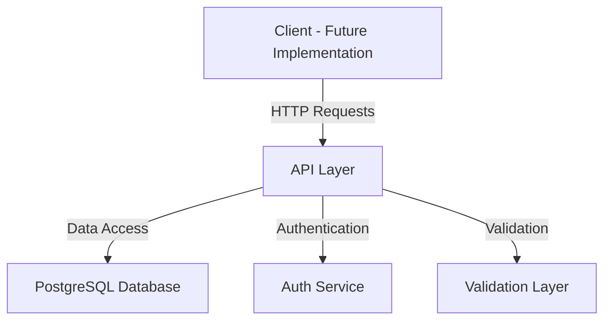
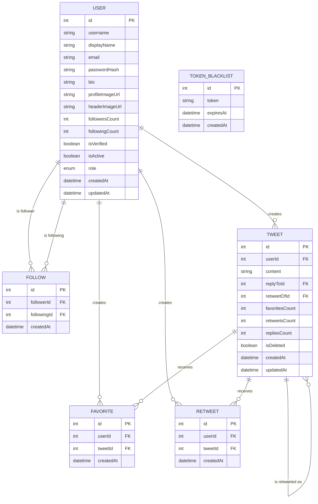
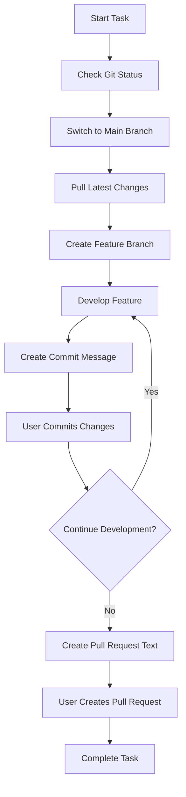
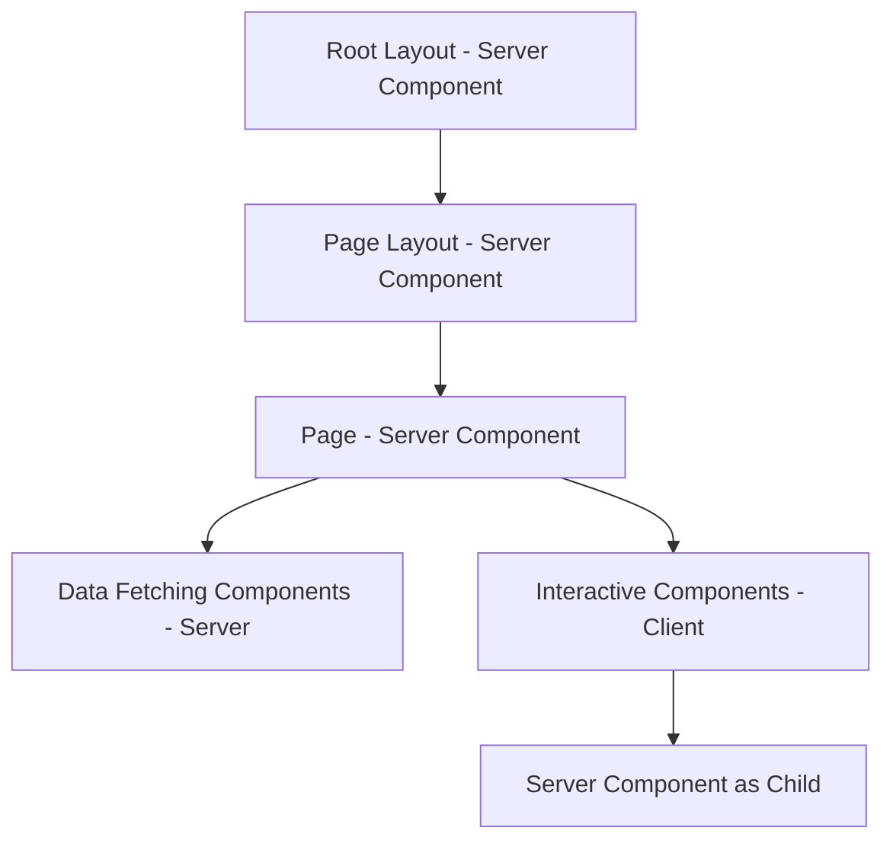

# System Patterns

## Architecture Overview

X-Echo follows a modern web application architecture with clear separation of concerns:



## Design Principles

### Functional Approach
- Prioritize pure functions
- Use immutable data structures
- Isolate side effects
- Ensure type safety

### Domain-Driven Design
- Distinguish between Value Objects and Entities
- Ensure consistency through Aggregates
- Abstract data access with Repositories
- Be conscious of Bounded Contexts

### Test-Driven Development
- Red-Green-Refactor cycle
- Treat tests as specifications
- Iterate in small units
- Continuous refactoring

## Key Design Patterns

### Result Type Pattern
Used to explicitly indicate success/failure in operations:

```typescript
type Result<T, E> = { ok: true; value: T } | { ok: false; error: E };
```

Benefits:
- Explicit error handling
- Type-safe error propagation
- Encourages early return pattern
- Clearly defined error types

### Branded Types Pattern
Used to ensure type safety with nominal typing:

```typescript
type Branded<T, B> = T & { _brand: B };
type Money = Branded<number, "Money">;
type Email = Branded<string, "Email">;
```

Benefits:
- Prevents type confusion
- Enhances code readability
- Enforces domain constraints
- Improves static analysis

### Const Object Pattern
Used instead of TypeScript enums to define a set of related constants:

```typescript
const UserErrorType = {
  VALIDATION_ERROR: "VALIDATION_ERROR",
  USER_ALREADY_EXISTS: "USER_ALREADY_EXISTS",
  USER_NOT_FOUND: "USER_NOT_FOUND",
} as const satisfies Record<string, string>;

type UserErrorType = (typeof UserErrorType)[keyof typeof UserErrorType];
```

Benefits:
- Smaller bundle size compared to TypeScript enums
- Better type safety
- More flexible type definitions
- Easier to add or modify values
- Avoids runtime issues with TypeScript enums

### Repository Pattern
Used to abstract data access:

- Handles only domain models
- Hides persistence details
- Provides in-memory implementation for testing

### Adapter Pattern
Used to abstract external dependencies:

- Interface defined by the caller
- Easily replaceable during testing
- Decouples core logic from external services

## Component Relationships

### API Layer
- Built with Hono framework
- Handles HTTP requests and responses
- Routes requests to appropriate controllers
- Manages middleware for cross-cutting concerns

### Controllers
- Handle request validation
- Coordinate service calls
- Transform data for responses
- Manage error handling

### Services
- Implement business logic
- Orchestrate repository calls
- Ensure domain rules are enforced
- Handle complex operations

### Repositories
- Abstract database access
- Return domain entities
- Handle persistence concerns
- Implement query logic

### Domain Models
- Represent core business entities
- Enforce invariants
- Implement business rules
- Define relationships

## Database Design

### Entity-Relationship Model



### Normalization Strategy
- Normalized structure for data integrity
- Strategic denormalization for performance (e.g., counter caching)

### Indexing Strategy
- Primary keys, foreign keys, and frequently queried fields are indexed
- Composite indexes for common query patterns

## Error Handling Strategy

### Error Types
- Validation errors (400)
- Authentication errors (401)
- Authorization errors (403)
- Resource not found errors (404)
- Conflict errors (409)
- Internal server errors (500)

### Error Response Format
```json
{
  "error": {
    "type": "ERROR_TYPE",
    "message": "Human-readable error message"
  }
}
```

## Security Patterns

### Authentication
- Password hashing with bcrypt
- JWT-based authentication with Hono JWT helper
- Token blacklisting for logout and security
- Role-based access control

### Data Protection
- Input validation with Zod
- Parameterized queries via Prisma
- HTTPS for all communications (production)

## Development Workflow Patterns

### Git Workflow


- Always check git status before starting work
- Always work on feature branches created from the latest main
- Create commit messages at appropriate times during development
- Create pull request text before completing work
- All git commands are executed manually by the user

## Performance Considerations

### Query Optimization
- Efficient indexing
- Pagination for large result sets
- Selective field retrieval

### Caching Strategy
- Counter caching in database
- Response caching (planned)
- Query result caching (planned)

## Frontend Architecture

### Next.js Component Architecture



### Server/Client Component Composition Patterns

#### Recommended Pattern: Passing Server Components as Children to Client Components

```typescript
// page.tsx (Server Component)
import ClientComponent from './client-component'
import ServerComponent from './server-component'

export default function Page() {
  return (
    <ClientComponent>
      <ServerComponent />
    </ClientComponent>
  )
}
```

#### Pattern to Avoid: Directly Importing Server Components into Client Components

```typescript
'use client'
// This pattern is not supported
import ServerComponent from './server-component'

export default function ClientComponent() {
  const [count, setCount] = useState(0)
  return (
    <>
      <button onClick={() => setCount(count + 1)}>{count}</button>
      <ServerComponent />
    </>
  )
}
```
